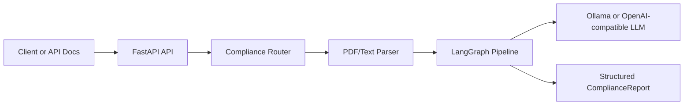
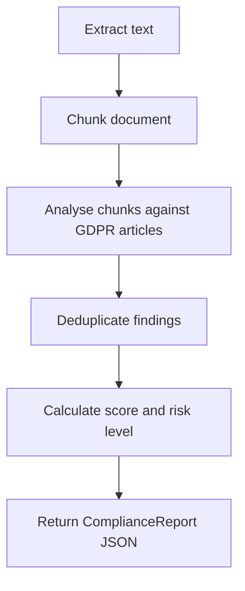
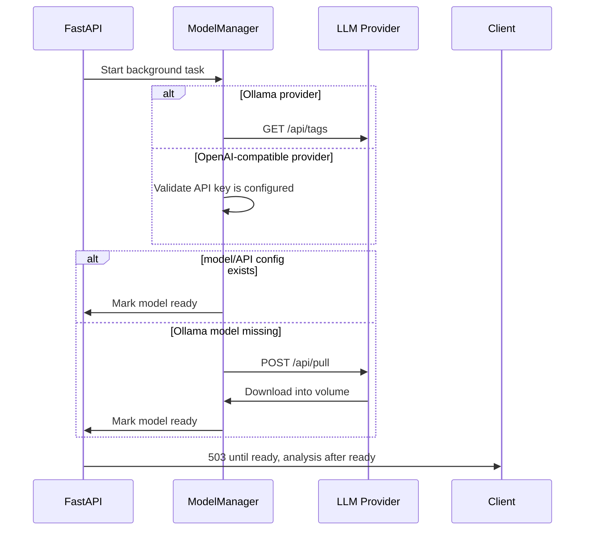

# Automated GDPR Compliance Checker

[](https://www.python.org/)
[](https://fastapi.tiangolo.com/)
[](https://ollama.com/)
[](https://platform.openai.com/docs)
[](https://www.docker.com/)
[](https://docs.astral.sh/ruff/)

AI-assisted GDPR/DSGVO compliance analysis for contracts, privacy policies, and terms of service.

This project demonstrates a production-oriented FastAPI backend that accepts plain text or PDF documents, analyses them against key GDPR articles, and returns a structured compliance report with risk scoring, violated articles, problematic excerpts, and actionable recommendations.

> Portfolio note: this is a technical screening tool, not legal advice. It is designed to show backend engineering, LLM integration, API design, Docker deployment, and practical product thinking.

## Demo Result

Given this intentionally risky policy text:

```text
We collect personal data for any purpose indefinitely without consent.
Users cannot request deletion or export their data.
The controller is not identified and international transfers may happen without safeguards.
```

The API returns a structured compliance report:

| Output field | Example result |
| --- | --- |
| Overall score | `25/100` |
| Overall risk | `critical` |
| Violated articles | `Art.5`, `Art.6`, `Art.13` |
| Finding type | lawful basis, transparency, retention, data subject rights |
| Response shape | typed `ComplianceReport` JSON |

Minimal output example:

```json
{
  "document_name": "sample-policy.txt",
  "overall_score": 25,
  "overall_risk": "critical",
  "summary": "Found 3 potential compliance issues across 3 GDPR articles. Score: 25/100.",
  "articles_violated": ["Art.5", "Art.6", "Art.13"],
  "processing_time_seconds": 6.68
}
```

## Why This Project Matters

Compliance review is expensive, repetitive, and difficult to scale. This application explores how local LLMs can support privacy and legal teams by automatically flagging high-risk clauses before human review.

The system is built around a pragmatic production pattern:

- The API starts immediately.
- Ollama runs as the default local model server.
- OpenAI-compatible chat APIs are supported through `LLM_PROVIDER=openai`.
- The application checks whether the configured model exists.
- With Ollama, if the model is missing, the application triggers Ollama's `/api/pull`.
- Analysis endpoints return `503` until the model is ready. (or the model can be stored in a shared volume).
- Models are stored in a persistent Ollama Docker volume.

No model is baked into the Docker image, and there is no fragile downloader sidecar or startup sleep script.

## Highlights

- **FastAPI backend** with typed request/response models.
- **Configurable LLM integration** through Ollama or an OpenAI-compatible chat API.
- **LangGraph pipeline** for document chunking and compliance analysis flow.
- **PDF and plain-text input support**.
- **Structured JSON output** using Pydantic schemas.
- **Automatic model lifecycle management** through an async model manager.
- **Docker Compose setup** for API + Ollama.
- **Ruff and pytest** for code quality and verification.

## What This Demonstrates

This repository is intended to show practical engineering ability beyond a simple CRUD API:

- designing an API around a real domain problem
- integrating an LLM service without blocking application startup
- handling slow external dependencies gracefully
- structuring a Python backend with clear module boundaries
- returning typed, predictable JSON responses
- containerising a multi-service local AI application
- documenting tradeoffs, limitations, and next steps

## Tech Stack

| Area | Tools |
| --- | --- |
| Backend | FastAPI, Uvicorn |
| AI orchestration | LangGraph, LangChain |
| LLM inference | Ollama/Gemma, OpenAI-compatible chat APIs |
| Data validation | Pydantic |
| PDF parsing | PyMuPDF |
| Packaging | Poetry |
| Deployment | Docker, Docker Compose |
| Quality | Ruff, pytest |

## Architecture



Pipeline:



Model lifecycle:



## Features

### Document Analysis

The API accepts:

- raw text through `/api/v1/analyse/text`
- PDF files through `/api/v1/analyse/pdf`

It returns:

- overall compliance score
- overall risk level
- GDPR articles checked
- GDPR articles potentially violated
- problematic document excerpts
- concise issue descriptions
- recommended fixes
- processing time

### GDPR Articles Covered

The example dataset made by summarizing articles from a real data source. The current rule set focuses on:

```text
Art.5, Art.6, Art.7, Art.13, Art.17, Art.20,
Art.25, Art.28, Art.32, Art.33, Art.44-49
```

The checklist is a practical summary of selected GDPR articles. The full legal text is available from the EU's EUR-Lex publication: [Regulation (EU) 2016/679](https://eur-lex.europa.eu/eli/reg/2016/679/oj).

### Scoring

| Score | Risk |
| --- | --- |
| 100-80 | Low risk, broadly compliant |
| 79-60 | Medium risk, needs review |
| 59-35 | High risk, significant issues |
| <35 | Critical risk, immediate review recommended |

## Quick Start With Docker

Requirements:

- Docker
- Docker Compose

Run the stack:

```bash
cd automated-gdpr-compliance-checker
docker compose up --build
```

Open the interactive API docs:

```text
http://localhost:8000/docs
```

Health check:

```bash
curl http://localhost:8000/health
```

Check Ollama models:

```bash
curl http://localhost:11434/api/tags
```

On the first run, `models` may be empty while the configured model is downloading. That is expected. The API will return `503` for analysis requests until Ollama finishes pulling the model.

## Run Locally Without Docker

Requirements:

- Python 3.14
- Poetry
- Ollama

Install Poetry if needed:

```bash
curl -sSL https://install.python-poetry.org | python3 -
export PATH="$HOME/.local/bin:$PATH"
```

Install dependencies:

```bash
poetry install
```

Start Ollama:

```bash
ollama serve
```

Start the API:

```bash
poetry run uvicorn automatedcompliancechecker.main:app --reload
```

Configuration:

| Environment variable | Default | Description |
| --- | --- | --- |
| `LLM_PROVIDER` | `ollama` | `ollama` for local model lifecycle management, or `openai` for OpenAI-compatible chat APIs |
| `OLLAMA_BASE_URL` | `http://localhost:11434` | Ollama server URL |
| `OLLAMA_MODEL` | `gemma3:4b` | Ollama model used for compliance analysis |
| `OPENAI_BASE_URL` | `https://api.openai.com/v1` | OpenAI-compatible API base URL |
| `OPENAI_MODEL` | `gpt-4o-mini` | OpenAI-compatible model used for compliance analysis |
| `OPENAI_API_KEY` | unset | API key used when `LLM_PROVIDER=openai` |

Use OpenAI's hosted API:

```bash
export LLM_PROVIDER=openai
export OPENAI_API_KEY="sk-..."
export OPENAI_MODEL="gpt-4o-mini"
poetry run uvicorn automatedcompliancechecker.main:app --reload
```

Test the OpenAI-compatible path with local Ollama, without using a paid OpenAI API call:

```bash
ollama serve
ollama pull gemma3:4b

LLM_PROVIDER=openai \
OPENAI_BASE_URL=http://localhost:11434/v1 \
OPENAI_API_KEY=ollama \
OPENAI_MODEL=gemma3:4b \
poetry run uvicorn automatedcompliancechecker.main:app --reload
```

## Example Requests

Analyse raw text:

```bash
curl -X POST http://localhost:8000/api/v1/analyse/text \
  -H "Content-Type: application/json" \
  -d '{
    "document_name": "sample-policy.txt",
    "text": "We collect personal data for any purpose indefinitely without consent. Users cannot request deletion or export their data. The controller is not identified and international transfers may happen without safeguards."
  }'
```

Analyse a PDF:

```bash
curl -X POST http://localhost:8000/api/v1/analyse/pdf \
  -F "file=@privacy_policy.pdf"
```

Example response:

```json
{
  "document_name": "sample-policy.txt",
  "overall_score": 25,
  "overall_risk": "critical",
  "summary": "Found 3 potential compliance issues across 3 GDPR articles. Score: 25/100.",
  "issues": [
    {
      "article_id": "Art.5",
      "article_title": "Principles of processing personal data",
      "issue_description": "Data must be processed lawfully, fairly, and transparently.",
      "problematic_text": "We collect personal data for any purpose indefinitely without consent.",
      "location": "Paragraphs 1-1",
      "risk_level": "high",
      "recommendation": "Define lawful purposes, retention limits, and transparent processing notices."
    }
  ],
  "articles_checked": ["Art.5", "Art.6", "Art.13"],
  "articles_violated": ["Art.5", "Art.6", "Art.13"],
  "processing_time_seconds": 6.68
}
```

## Code Quality

Run lint checks:

```bash
poetry run ruff check src tests
```

Run tests:

```bash
poetry run pytest tests -q
```

## Engineering Decisions

- **Provider-aware LLM inference:** documents can be analysed locally through Ollama or through an OpenAI-compatible chat API.
- **Non-blocking startup:** the API does not wait for large model downloads before becoming reachable.
- **Application-owned readiness:** the backend decides whether analysis can run and returns `503` while the model is unavailable.
- **Persistent model storage:** Ollama stores downloaded models in a Docker volume.
- **Typed API contracts:** Pydantic models define the request and report schema.
- **Modular pipeline design:** parsing, model lifecycle, analysis, and report building are separated into focused modules.

## Limitations

- This is not legal advice and should not replace qualified legal review.
- Small local models may miss nuanced issues or produce false positives.
- Scanned image PDFs are not supported unless OCR is added.
- Current keyword and article coverage is focused on common GDPR risk areas.
- English and German language support are the primary target.

## Future Improvements

- [ ] Streaming model download status endpoint.
- [ ] Frontend dashboard for uploading documents and reviewing reports.
- [ ] OCR support for scanned PDFs.
- [ ] Multi-model routing for speed vs accuracy.
- [ ] Exportable PDF/HTML compliance reports.
